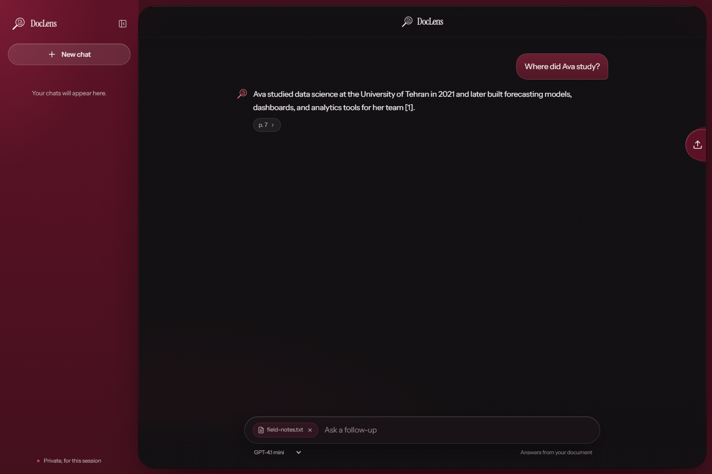

# DocLens

Ask questions about your documents and get grounded answers with source citations.



## RAG pipeline

DocLens combines semantic and lexical retrieval to find relevant passages before generating an answer:

1. Extract text and page numbers from PDF, DOCX, DOC, Markdown, and TXT files.
2. Split the text into 900-character chunks with 120-character overlap.
3. Create 1536-dimensional `text-embedding-3-small` embeddings through AvalAI and store them in PostgreSQL with `pgvector`.
4. Retrieve the 20 nearest vector matches, rerank them with BM25 lexical relevance, and pass the best five passages to the answer model.
5. Stream the answer with citations linked to the retrieved source passages.

Chat supports GPT-4.1 mini and Claude Haiku 4.5 through AvalAI.

## Stack

Next.js, TypeScript, AI SDK, AvalAI, PostgreSQL, and `pgvector`.

## Run locally

Requirements: Node.js 22.16 or newer and Docker Compose.

```sh
npm ci
```

Copy `.env.example` to `.env.local`, add your `DOCLENS_AVALAI_API_KEY`, then start the local database and apply migrations:

```sh
npm run db:up
npm run db:migrate
npm run dev
```

Open [http://localhost:3000](http://localhost:3000). Run `npm run check` and `npm run build` to verify changes.

## Deploy

Use a PostgreSQL service with the `pgvector` extension. Configure `DATABASE_URL`, `DOCLENS_AVALAI_API_KEY`, `APP_ORIGIN`, and a random `CRON_SECRET` in Vercel, then run `npm run db:migrate` against the production database. Vercel Functions limit request bodies to 4.5 MB; larger document uploads need direct object storage.
